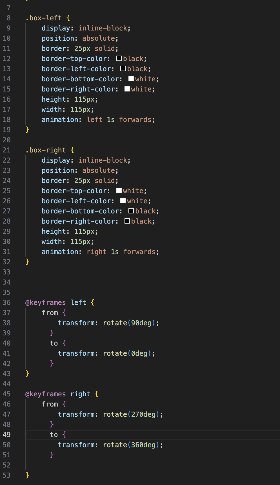
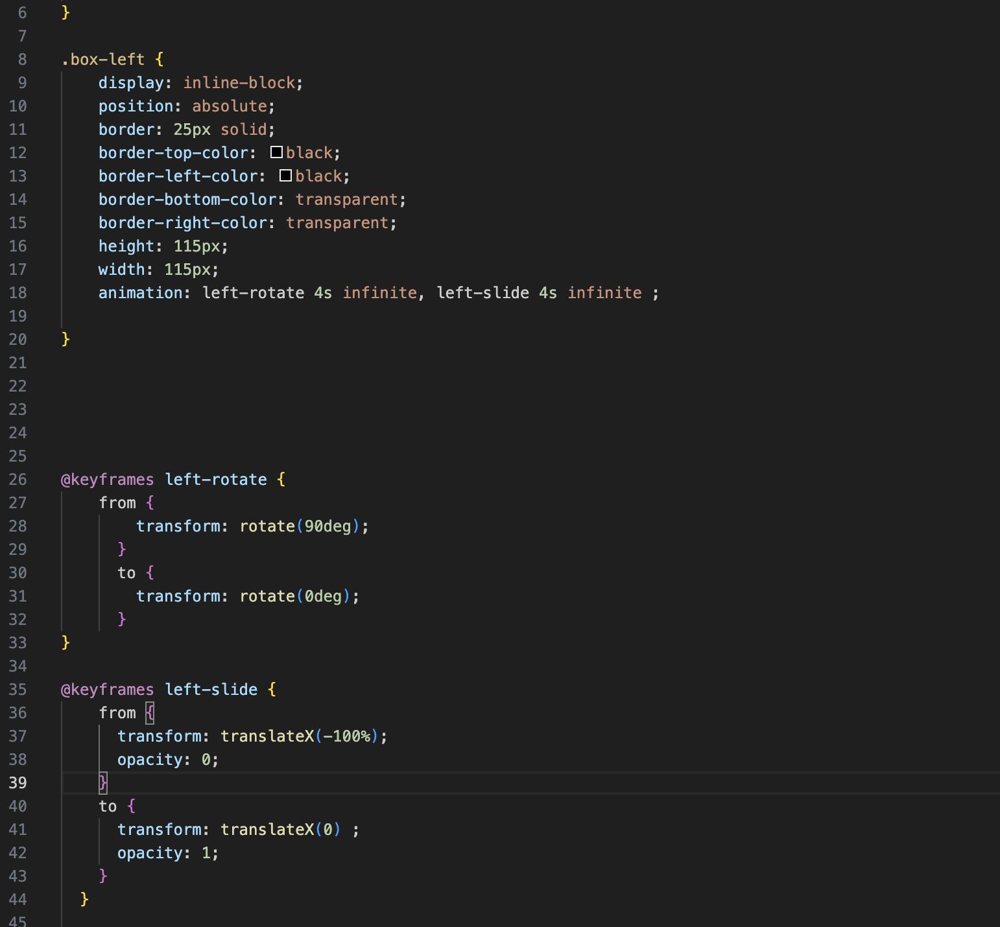
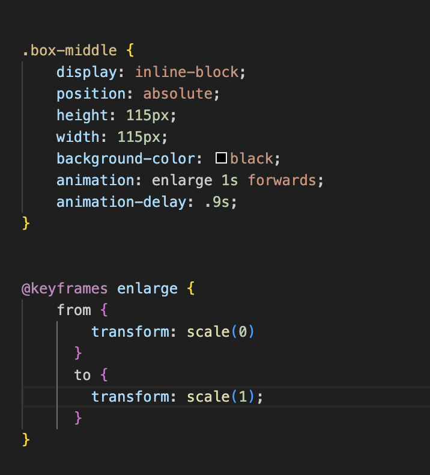

# is120-hw8-aaron-garry
CSS Animation

Screenshots:

- This was actually a really fun process. I enjoyed breaking this problem down into pieces. I decided to start with the borders by making them two seperate divs. I made them look like one by using position absolute and centered them using flexbox on the body. What I struggled with is making the rest of the border not overlap with the other div. I tried using white but it wouldn't work as you couldn't see the first div(screenshot1). I looked it up and found out you can do transparent as a color which worked well. 
I animated the rotation first which was simple. But when I tried to slide it along the X axis it worked as well but both would not animate together (screenshot 2 and 3). I asked claude and learned the second will override the first. I ended up putting both transform animations in the same line. 
The last thing was to make the center appear. I had used scale prieveusly to make something larger on a hover. I tried going from scale 0 -> 1 for the animation and it worked. The problem was when I added an animation delay it broke (screenshot 4). I ended up putting the background color in the 'to' part of the keyframes and it was great.
I spent a long time messing with the timing of all 3 divs and how far the x axis transform would be until it looked as close as I could get it. 